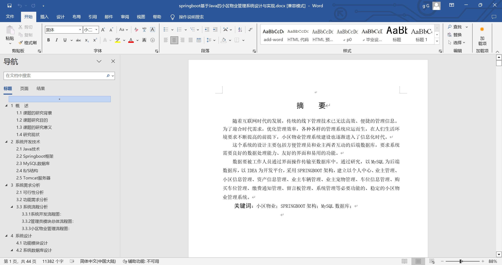
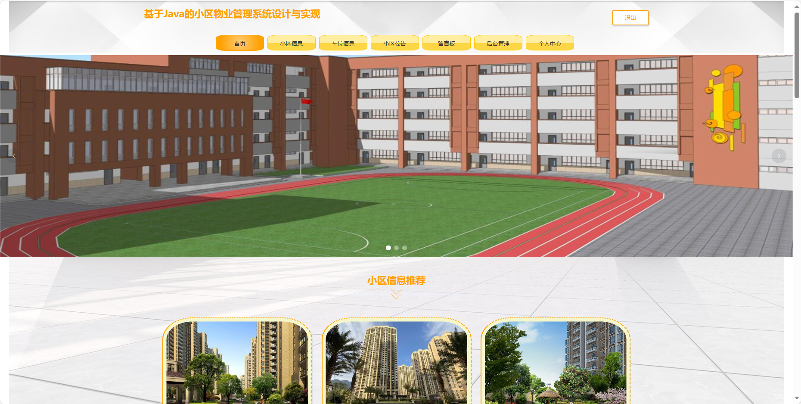
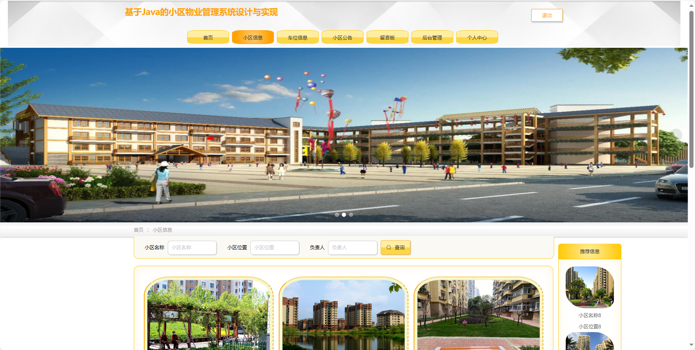
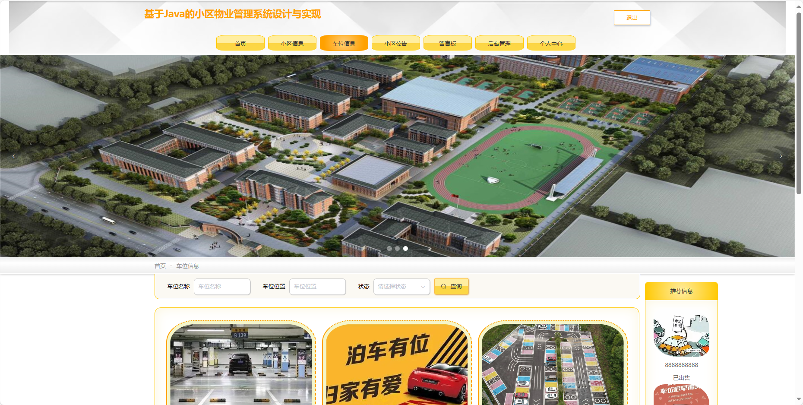
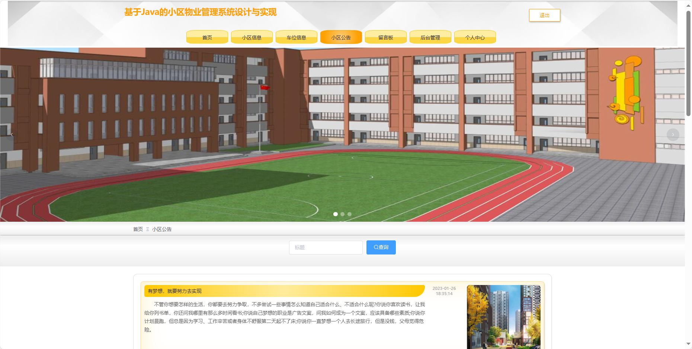
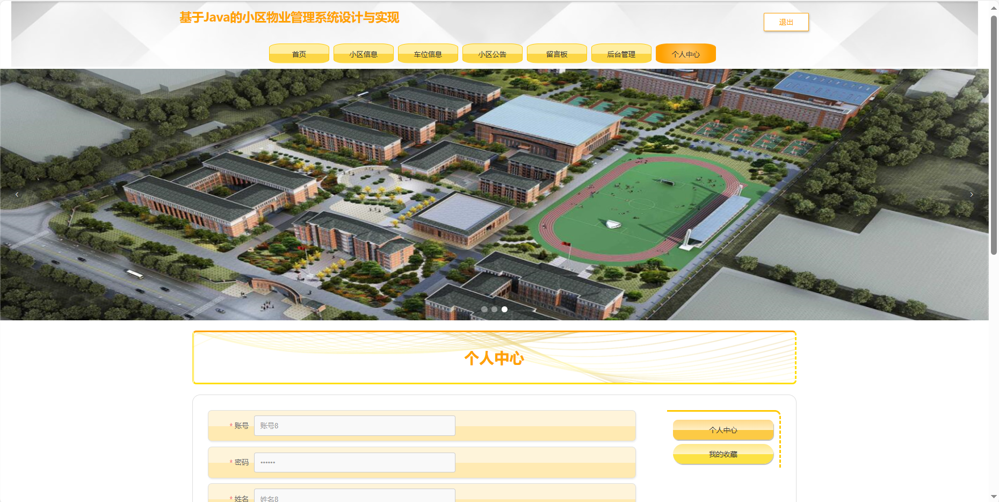
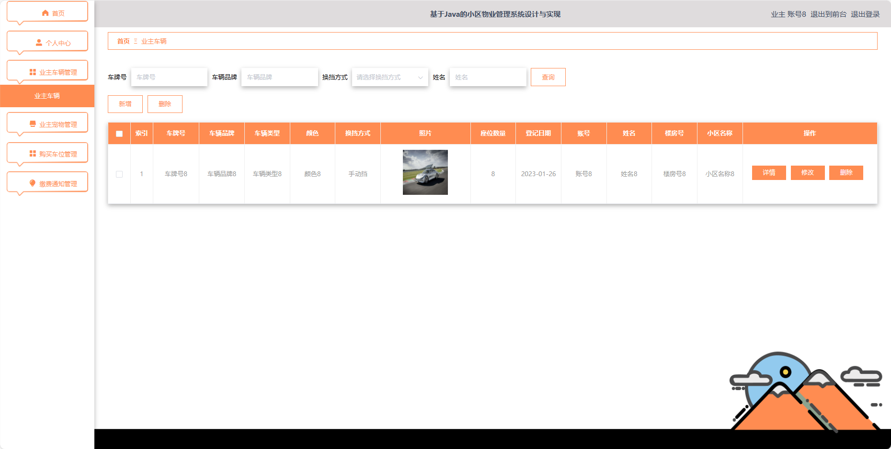
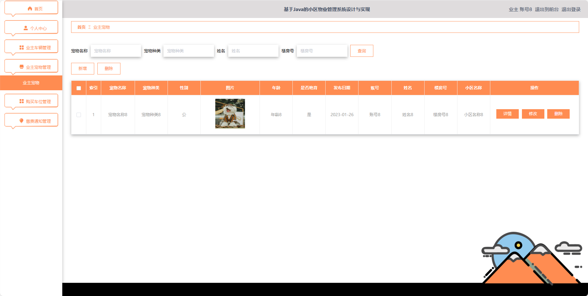
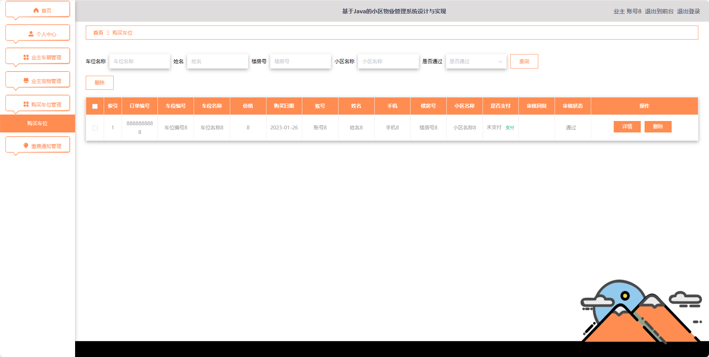

基于Springboot的小区物业管理系统（程序+论文）
=
### 完整代码获取地址：从戎源码网 ([https://armycodes.com/](https://armycodes.com/))
### 作者微信：19941326836  QQ：952045282 
### 承接计算机毕业设计、Java毕业设计、Python毕业设计、深度学习、机器学习
### 选题+开题报告+任务书+程序定制+安装调试+论文+答辩ppt 一条龙服务
### 所有选题地址https://github.com/nature924/allProject

一、项目介绍
---
基于Spring Boot框架实现的小区物业管理系统，系统包含两种角色：管理员、用户,系统分为前台和后台两大模块，主要功能如下。
### 【前台功能】

1. 首页：提供用户进入系统的入口。
2. 小区信息：用户可以查看小区的基本信息。
3. 车位信息：用户可以查询和管理小区的车位信息。
4. 小区公告：展示小区发布的最新通知和公告。
5. 留言板：用户可以在留言板上发表意见、提问等。
6. 后台管理：提供进入后台管理的入口。
7. 个人中心：用户可以管理个人信息。

### 【用户后台功能】
1. 首页：提供用户进入后台管理的入口。
2. 个人中心：用户可以管理个人信息。
3. 业主车辆管理：用户可以添加、编辑、删除自己的车辆信息。
4. 业主宠物管理：用户可以添加、编辑、删除自己的宠物信息。
5. 购买车位管理：用户可以查看和管理自己购买的车位信息。
6. 缴费通知管理：用户可以查看小区物业费用通知。

### 【管理员后台功能】
1. 首页：提供管理员进入后台管理的入口。
2. 个人中心：管理员可以管理个人信息。
3. 业主管理：添加、编辑、删除业主账号。
4. 小区信息管理：管理小区的基本信息。
5. 物业人员管理：添加、编辑、删除物业人员账号。
6. 资产信息管理：管理小区的资产信息。
7. 业主车辆管理：查看、编辑、删除业主的车辆信息。
8. 业主宠物管理：查看、编辑、删除业主的宠物信息。
9. 车位信息管理：管理小区的车位信息。
10. 购买车位管理：查看和管理业主购买的车位信息。
11. 缴费通知管理：发布、编辑、删除物业费用通知。
12. 留言板管理：管理留言板上的信息。
13. 系统管理：管理系统的基础设置。

### 【物业人员后台功能】
1. 首页：提供物业人员进入后台管理的入口。
2. 个人中心：物业人员可以管理个人信息。
3. 资产信息管理：管理小区的资产信息。
4. 缴费通知管理：物业人员可以发布、编辑、删除物业费用通知。

二、项目技术
---
- 编程语言：Java
- 数据库：MySQL
- 项目管理工具：Maven
- 前端技术：VUE、HTML、Jquery、Bootstrap
- 后端技术：Spring、SpringMVC、MyBatis

三、运行环境
---
- 操作系统：Windows、macOS都可以
- JDK版本：JDK1.8以上都可以
- 开发工具：IDEA、Ecplise、Myecplise都可以
- 数据库: MySQL5.7以上都可以
- Tomcat：任意版本都可以
- Maven：任意版本都可以

四、运行截图
---
### 论文截图：

### 程序截图：

